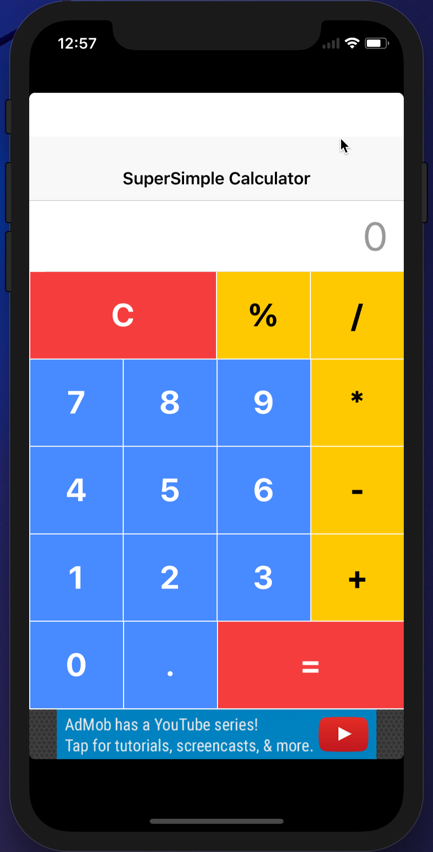

## Ionic3_3rdTutorial

How to polish our existing calculator application

The step by step tutorial is published and you can, of course, check it out for free: [How to polish our existing calculator application]().

### How to use this code
+ make sure you have Ionic installed. For instructions on how to, please check out the first tutorial in this series: [How to get started with Ionic framework 3 on Mac and Windows](http://www.nikola-breznjak.com/blog/javascript/ionic3/get-started-ionic-framework-3-mac-windows/)
+ clone the code from this repo
+ in the project directory execute `ionic lab` to run the project locally in your browser
+ to get the ads working, you'll have to run it in your simulator or on your device (see the tutorial for how to do this)